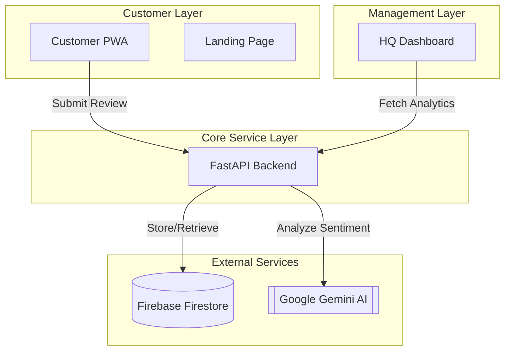

# Reflo: AI-Powered Restaurant Review Management Ecosystem

**Reflo** is a comprehensive, enterprise-ready platform designed to transform how restaurants manage customer feedback and engagement. By leveraging state-of-the-art AI, Reflo automates the analysis of reviews, identifies operational risks in real-time, and provides actionable insights across multiple branches through a seamless, multi-platform experience.

---

## 🚀 The Ecosystem

Reflo is composed of four primary components, each tailored for a specific stakeholder in the restaurant ecosystem:

### 🧠 [Backend Service](./backend)
The "Brain" of Reflo. A high-performance API built with **FastAPI** that orchestrates AI analysis and data persistence.
- **AI Analysis Pipeline**: Automatically processes reviews using **Google Gemini 2.0 Flash** for sentiment analysis, risk categorization, and performance scoring.
- **Automated Escalation**: Triggers real-time alerts and creates escalation tasks for high-risk or low-rated reviews.
- **Data Persistence**: Scalable and secure storage using **Firebase Firestore**.
- **Comprehensive Analytics**: Exposes detailed metrics for branch comparisons and staff performance.

### 📊 [HQ Dashboard (Frontend)](./frontend)
A powerful management console for restaurant owners and regional managers.
- **Executive Overview**: Real-time visualization of performance metrics across all branches using **Recharts**.
- **Branch Management**: Deep-dive into specific location data, staff metrics, and escalation statuses.
- **Modern UI**: Built with **React**, **Vite**, and **Tailwind CSS** for a premium, responsive experience.

### 📱 [Customer PWA](./pwa/reflo-pwa)
A mobile-first, installable Progressive Web App (PWA) that closes the loop between customers and the kitchen.
- **Dynamic Menu**: Browsable digital menu with item-specific details.
- **Seamless Feedback**: Intuitive review submission flow optimized for mobile devices.
- **Tech Stack**: Powered by **Zustand** for state management and **Material UI (MUI)** for a native-like feel.

### 🌐 [Landing Page](./landing-page)
The public-facing marketing presence of Reflo.
- **High-Impact Visuals**: Smooth animations powered by **Framer Motion**.
- **Responsive Design**: Clean and professional introduction to the Reflo value proposition.

---

## 🛠️ Architecture Overview

Reflo follows a modern, decoupled architecture:



---

## ⚡ Quick Start

### Prerequisites
- **Python 3.11+** (for Backend)
- **Node.js 18+** (for Frontend/PWA/Landing Page)
- **Firebase Project** with Firestore enabled
- **Google Gemini API Key**

### 1. Backend Setup
```bash
cd backend
python -m venv .venv
source .venv/bin/activate  # Windows: .venv\Scripts\activate
pip install -r requirements.txt
# Configure .env (see backend/README.md)
uvicorn app.main:app --reload
```

### 2. Frontend/PWA/Landing Page Setup
Each frontend component follows a similar setup pattern:
```bash
cd [component-directory]
npm install
npm run dev
```

---

## 📄 Documentation

For detailed setup instructions and API specifications for each component, please refer to their respective directories:

- [Backend Documentation](./backend/README.md)
- [HQ Dashboard Documentation](./frontend/README.md)
- [Customer PWA Documentation](./pwa/reflo-pwa/README.md)

---

<p align="center">
  Built with ❤️ by GitSetGo
</p>
